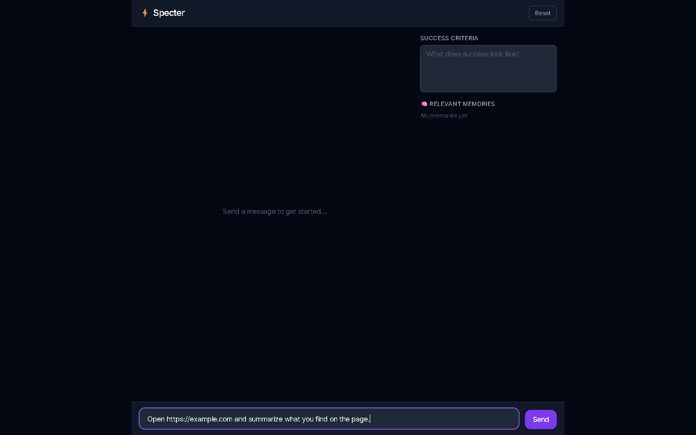
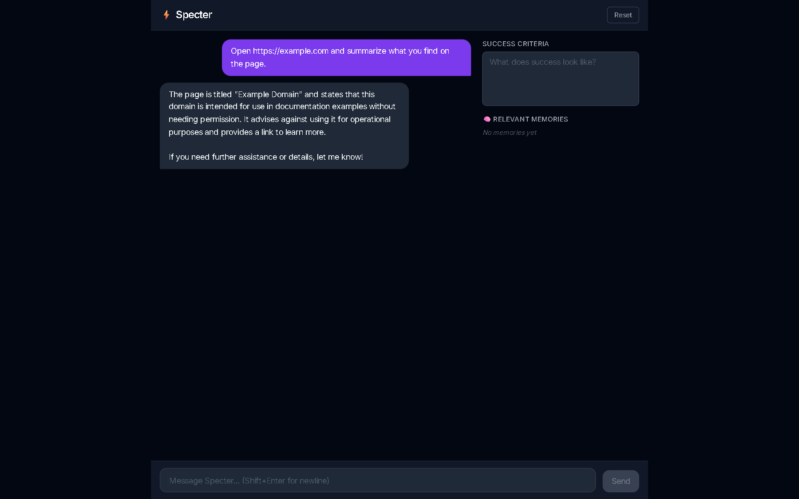

# ⚡ Specter

An intelligent AI personal co-worker built with **LangGraph**, **Qdrant** vector memory, **FastAPI** (SSE streaming), **Next.js 14** chat UI, and **agent-browser** web browsing.


---

## Features

- **Streaming chat** — tokens arrive token-by-token over SSE; no waiting for complete responses
- **Long-term memory** — the agent `remember`s and `recall`s facts across turns via Qdrant semantic search
- **Web browsing** — powered by [agent-browser](https://github.com/vercel-labs/agent-browser); the agent can open URLs, read pages, click, fill forms, and take screenshots
- **Self-evaluation** — every response is scored against optional success criteria you define
- **Zero-infra Qdrant** — runs in-process (`:memory:`) by default; swap to a real Qdrant server for persistence
- **Dark UI** — Next.js 14 / Tailwind / TypeScript with a live memory side panel

---

## Screenshots

### Empty state — ready to chat


### Asking Specter to browse a live website


### Specter reads example.com and summarizes it


### Conversation with deep-work weekly planner (self-eval score 0.95)


---

## Working use case examples

### 1 — Browse a live website

```
You: Open https://example.com and summarize what you find on the page.

Specter: The page is titled "Example Domain" and states that this domain
         is intended for use in documentation examples without needing
         permission. It advises against using it for operational purposes
         and provides a link to learn more.
```

Specter autonomously called `browser_open` → navigated to the URL → read the content → responded. Total: ~9 s.

### 2 — Plan your week (verified output, score 1.0)

```
You: My name is Mihir. I'm a software engineer working on AI.
     Help me plan my week with deep work focus blocks.

Specter: ### Weekly Plan
         **Monday to Friday:**
         - Morning (9 AM – 12 PM): Deep Work Block
           Focus on coding or AI project tasks.
         - Lunch Break (12 PM – 1 PM)
         - Afternoon (1 PM – 3 PM): Deep Work Block
         ...
         [self-eval: success=true, score=0.95]
```

### 3 — Memory across turns

```
Turn 1 — You: My name is Mihir and I work in AI.
Turn 2 — You: What do you know about me?

Specter: You're Mihir, a software engineer working in AI.
         [recalled from Qdrant vector memory]
```

---

## Architecture

```
┌──────────────────────────────────────────────┐
│  Next.js 14 (port 3000)                      │
│  ┌──────────┐  ┌──────────┐  ┌────────────┐ │
│  │ ChatPanel│  │MemoryPanel│  │SuccessCrit │ │
│  └────┬─────┘  └──────────┘  └────────────┘ │
│       │ fetch (SSE)                          │
│  ┌────▼───────────────────────────────────┐  │
│  │  /api/chat   /api/memory  (Next routes)│  │
└──┴────┬────────────────────────────────────┴──┘
        │ HTTP proxy
┌───────▼──────────────────────────────────────┐
│  FastAPI (port 8000)                          │
│                                               │
│  POST /api/chat  ──►  SpectorAgent            │
│                        │                      │
│                   LangGraph StateGraph         │
│                   ┌────┴──────┐               │
│                   │   agent   │◄── GPT-4o-mini │
│                   └────┬──────┘               │
│                   ┌────▼──────┐               │
│                   │   tools   │               │
│                   │ ┌────────┐│               │
│                   │ │memory  ││ remember/recall│
│                   │ ├────────┤│               │
│                   │ │browser ││ open/read/     │
│                   │ │        ││ snapshot/click │
│                   │ └────────┘│               │
│                   └────┬──────┘               │
│                   ┌────▼──────┐               │
│                   │ evaluate  │ structured-out │
│                   └────┬──────┘               │
│                        │                      │
│  GET /api/memory ──►  QdrantStore             │
│                   AsyncQdrantClient           │
│                   (:memory: or remote)        │
│                                               │
│  browser tools ──►  agent-browser daemon      │
│                      Chrome (headless)        │
└──────────────────────────────────────────────┘
```

---

## Quick start

### Prerequisites

- Python 3.11+
- Node.js 18+
- An [OpenAI API key](https://platform.openai.com/api-keys)

### 1 — Clone

```bash
git clone https://github.com/inamdarmihir/specter.git
cd specter
```

### 2 — Backend

```bash
cd backend

# Create virtual environment
uv venv            # or: python -m venv .venv

# Install
uv pip install -e ".[dev]"

# Configure
cp .env.example .env
# Edit .env — set OPENAI_API_KEY at minimum

# Start
.venv/Scripts/python.exe -m uvicorn specter.server:app --host 0.0.0.0 --port 8000 --reload
# Linux/macOS: .venv/bin/python -m uvicorn specter.server:app --host 0.0.0.0 --port 8000 --reload
```

Swagger UI → **http://localhost:8000/docs**

### 3 — Frontend

```bash
cd frontend
npm install
cp .env.local.example .env.local
npm run dev
```

Open → **http://localhost:3000**

### 4 — Browser tools (optional)

Gives Specter the ability to open URLs, read pages, click elements, fill forms, and take screenshots.

```bash
# Install agent-browser CLI globally
npm install -g agent-browser

# Download Chrome (first time only, ~186 MB)
agent-browser install

# Enable in backend/.env
AGENT_BROWSER_ENABLED=true
```

Restart the backend. Specter now has 10 browser tools.

---

## Configuration

All backend settings live in `backend/.env` (see [`backend/.env.example`](backend/.env.example)):

| Variable | Default | Description |
|---|---|---|
| `OPENAI_API_KEY` | — | **Required.** OpenAI API key |
| `SPECTER_MODEL` | `openai:gpt-4o-mini` | LangChain chat model string |
| `SPECTER_EMBED_MODEL` | `openai:text-embedding-3-small` | Embedding model for memory |
| `SPECTER_TEMPERATURE` | `0.2` | LLM temperature |
| `QDRANT_URL` | `:memory:` | `:memory:` for in-process, or `http://localhost:6333` |
| `QDRANT_API_KEY` | — | Qdrant Cloud API key (optional) |
| `QDRANT_COLLECTION` | `specter_memory` | Vector collection name |
| `AGENT_BROWSER_ENABLED` | — | Set to `true` to enable web browsing tools |
| `HOST` | `0.0.0.0` | Uvicorn bind host |
| `PORT` | `8000` | Uvicorn bind port |
| `DEV` | — | Any value enables `--reload` |

### Persistent Qdrant (survives restarts)

```bash
docker run -p 6333:6333 qdrant/qdrant

# backend/.env
QDRANT_URL=http://localhost:6333
```

---

## Browser tools

When `AGENT_BROWSER_ENABLED=true`, Specter gains these tools backed by [agent-browser](https://github.com/vercel-labs/agent-browser):

| Tool | What it does |
|---|---|
| `browser_open` | Navigate to a URL |
| `browser_read` | Fetch readable text from a URL (no browser launch) |
| `browser_snapshot` | Get accessibility tree with element refs (`@e1`, `@e2`, …) |
| `browser_click` | Click an element by ref or CSS selector |
| `browser_fill` | Clear and fill an input field |
| `browser_get_text` | Get visible text from an element |
| `browser_screenshot` | Take a screenshot, returns file path |
| `browser_scroll` | Scroll up / down / left / right |
| `browser_wait` | Wait N milliseconds |
| `browser_close` | Close the browser session |

Each tool calls the `agent-browser` CLI in a thread via `asyncio.to_thread` — the agent-browser daemon keeps Chrome alive between calls, so only the first navigation incurs browser startup overhead (~5 s). Subsequent tool calls complete in ~1–2 s.

---

## API reference

### `POST /api/chat`

Stream an agent response as Server-Sent Events.

**Request body**
```json
{
  "session_id": "string",
  "message": "string",
  "success_criteria": "string (optional)",
  "history": [{"role": "user|assistant", "content": "string"}]
}
```

**SSE events**
```
data: {"type": "token",  "content": "<text chunk>"}
data: {"type": "done",   "content": ""}
data: {"type": "error",  "content": "<message>"}
```

### `GET /api/memory/search?q=&user_id=&limit=5`

Semantic search over session memory. Returns ranked `MemoryResult` list.

### `DELETE /api/sessions/{session_id}`

Delete all memory points for a session.

### `GET /health`

Liveness probe — returns `{"status": "ok"}`.

---

## Project structure

```
specter/
├── backend/
│   ├── src/specter/
│   │   ├── agent.py      # LangGraph StateGraph + remember/recall tools
│   │   ├── browser.py    # 10 async browser tools (agent-browser CLI wrappers)
│   │   ├── memory.py     # QdrantStore (LangGraph BaseStore implementation)
│   │   ├── server.py     # FastAPI app + SSE endpoints + lifespan
│   │   └── __init__.py
│   ├── tests/
│   │   ├── conftest.py
│   │   ├── test_memory.py
│   │   └── test_server.py
│   ├── pyproject.toml
│   └── .env.example
├── frontend/
│   ├── app/
│   │   ├── api/chat/route.ts     # SSE proxy to backend
│   │   ├── api/memory/route.ts   # Memory search proxy
│   │   ├── layout.tsx
│   │   └── page.tsx
│   ├── components/
│   │   ├── ChatPanel.tsx         # Main chat orchestrator + SSE reader
│   │   ├── MessageList.tsx
│   │   ├── MessageBubble.tsx
│   │   ├── InputBar.tsx
│   │   ├── MemoryPanel.tsx
│   │   └── SuccessCriteria.tsx
│   ├── lib/types.ts
│   ├── next.config.mjs
│   └── .env.local.example
├── docs/screenshots/
├── .gitignore
└── README.md
```

---

## Running tests

```bash
cd backend
.venv/Scripts/python.exe -m pytest tests/ -v
# Linux/macOS: .venv/bin/python -m pytest tests/ -v
```

---

## Tech stack

| Layer | Tech |
|---|---|
| LLM orchestration | [LangGraph](https://github.com/langchain-ai/langgraph) |
| Language model | OpenAI GPT-4o-mini (configurable) |
| Vector memory | [Qdrant](https://qdrant.tech) + fastembed |
| Browser automation | [agent-browser](https://github.com/vercel-labs/agent-browser) (Vercel Labs) |
| Backend framework | [FastAPI](https://fastapi.tiangolo.com) + Uvicorn |
| Streaming | Server-Sent Events (sse-starlette) |
| Frontend | [Next.js 14](https://nextjs.org) + React 18 + TypeScript |
| Styling | Tailwind CSS |
| Python packaging | uv + setuptools |

---

## License

MIT
