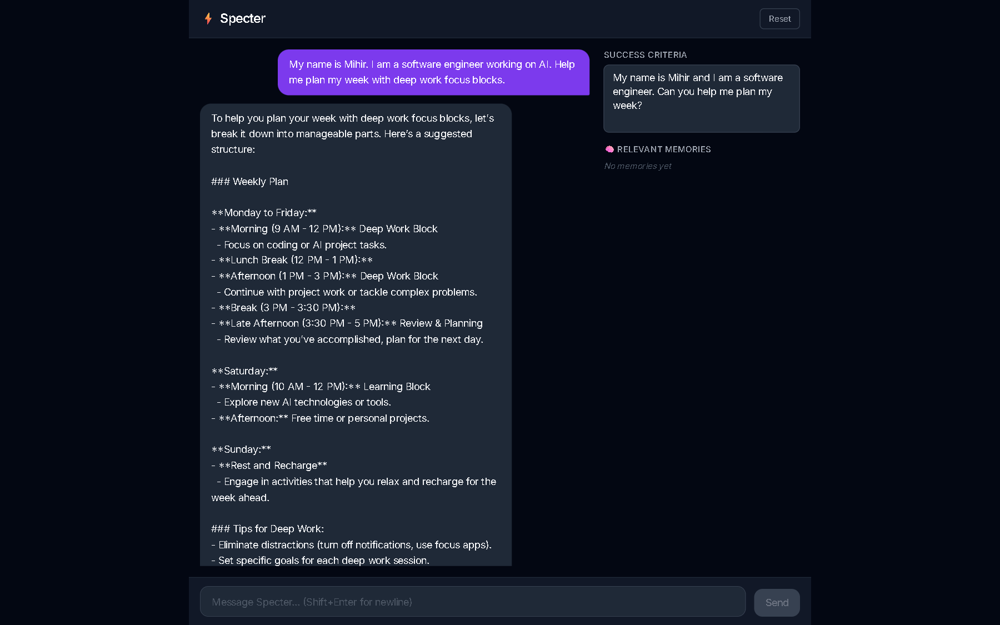
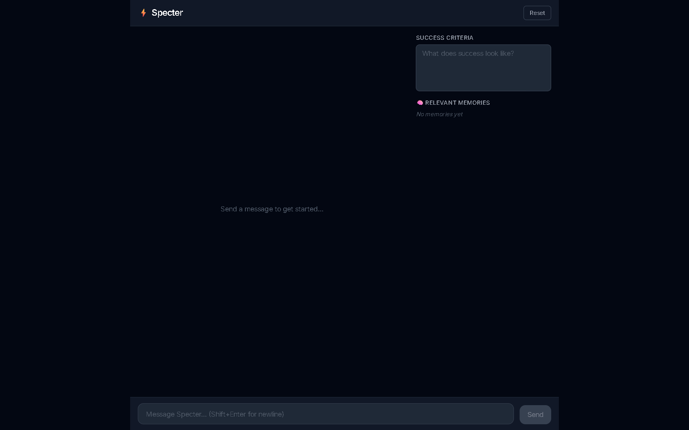
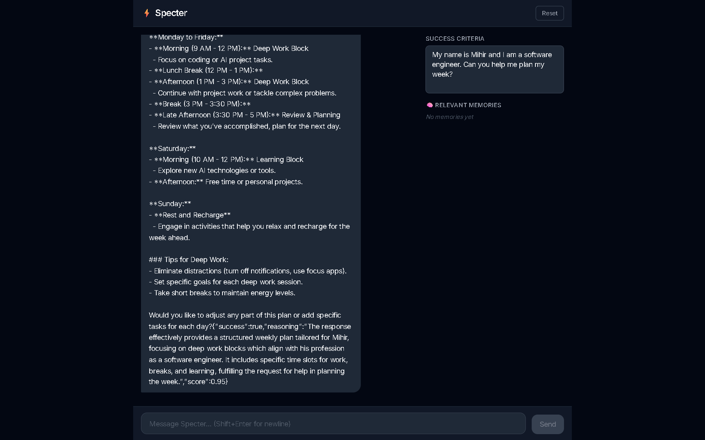

# ⚡ Specter

An intelligent AI personal co-worker built with **LangGraph**, **Qdrant** vector memory, **FastAPI** (SSE streaming), and a **Next.js 14** chat UI.



---

## Features

- **Streaming chat** — tokens stream token-by-token over SSE; no waiting for full responses
- **Long-term memory** — the agent automatically `remember`s and `recall`s facts across turns using Qdrant semantic search
- **Self-evaluation** — after every response the agent scores itself against optional success criteria you define
- **Zero-infra Qdrant** — runs fully in-process (`:memory:`) with no Docker; swap to a real Qdrant server for persistence
- **Dark UI** — Next.js 14 / Tailwind / TypeScript with a side panel showing relevant memories in real time

---

## Screenshots

### Empty state


### Live conversation with deep-work weekly plan


### Bottom of response — self-evaluation score (0.95)


---

## Architecture

```
┌─────────────────────────────────────────────┐
│  Next.js 14 (port 3000)                     │
│  ┌──────────┐  ┌──────────┐  ┌───────────┐ │
│  │ ChatPanel│  │MemoryPanel│  │SuccessCrit│ │
│  └────┬─────┘  └──────────┘  └───────────┘ │
│       │ fetch (SSE)                         │
│  ┌────▼──────────────────────────────────┐  │
│  │  /api/chat  /api/memory  (Next routes)│  │
└──┴────┬──────────────────────────────────┴──┘
        │ HTTP proxy
┌───────▼──────────────────────────────────────┐
│  FastAPI (port 8000)                          │
│                                               │
│  POST /api/chat  ──►  SpectorAgent            │
│                        │                      │
│                   LangGraph StateGraph         │
│                   ┌────┴─────┐                │
│                   │  agent   │◄─── GPT-4o-mini│
│                   └────┬─────┘                │
│                   ┌────▼─────┐                │
│                   │  tools   │ remember/recall │
│                   └────┬─────┘                │
│                   ┌────▼─────┐                │
│                   │ evaluate │ structured-out  │
│                   └────┬─────┘                │
│                        │                      │
│  GET /api/memory ──►  QdrantStore             │
│                        │                      │
│                   AsyncQdrantClient           │
│                   (:memory: or remote)        │
└──────────────────────────────────────────────┘
```

---

## Quick start

### Prerequisites

- Python 3.11+
- Node.js 18+
- An [OpenAI API key](https://platform.openai.com/api-keys)

### 1 — Clone

```bash
git clone https://github.com/inamdarmihir/specter.git
cd specter
```

### 2 — Backend

```bash
cd backend

# Create virtual environment
uv venv            # or: python -m venv .venv

# Install (editable + dev extras)
uv pip install -e ".[dev]"

# Configure
cp .env.example .env
# Edit .env — set OPENAI_API_KEY at minimum

# Start
.venv/Scripts/python.exe -m uvicorn specter.server:app --host 0.0.0.0 --port 8000 --reload
# Linux/macOS: .venv/bin/python -m uvicorn specter.server:app --host 0.0.0.0 --port 8000 --reload
```

Swagger UI: **http://localhost:8000/docs**

### 3 — Frontend

```bash
cd frontend
npm install
cp .env.local.example .env.local   # NEXT_PUBLIC_API_URL=http://localhost:8000
npm run dev
```

Open **http://localhost:3000**

---

## Configuration

All backend settings live in `backend/.env` (see [`backend/.env.example`](backend/.env.example)):

| Variable | Default | Description |
|---|---|---|
| `OPENAI_API_KEY` | — | **Required.** OpenAI API key |
| `SPECTER_MODEL` | `openai:gpt-4o-mini` | LangChain chat model string |
| `SPECTER_EMBED_MODEL` | `openai:text-embedding-3-small` | Embedding model for memory |
| `SPECTER_TEMPERATURE` | `0.2` | LLM temperature |
| `QDRANT_URL` | `:memory:` | Qdrant URL or `:memory:` for in-process |
| `QDRANT_API_KEY` | — | Qdrant Cloud API key (optional) |
| `QDRANT_COLLECTION` | `specter_memory` | Collection name |
| `HOST` | `0.0.0.0` | Uvicorn bind host |
| `PORT` | `8000` | Uvicorn bind port |
| `DEV` | — | Set to any value to enable hot-reload |

### Using a real Qdrant server (persistent memory)

```bash
# Start Qdrant with Docker
docker run -p 6333:6333 qdrant/qdrant

# Then in backend/.env
QDRANT_URL=http://localhost:6333
```

---

## API reference

### `POST /api/chat`

Stream an agent response as Server-Sent Events.

**Request body**
```json
{
  "session_id": "string",
  "message": "string",
  "success_criteria": "string (optional)",
  "history": [{"role": "user|assistant", "content": "string"}]
}
```

**SSE events**
```
data: {"type": "token",  "content": "<text chunk>"}
data: {"type": "done",   "content": ""}
data: {"type": "error",  "content": "<message>"}
```

### `GET /api/memory/search?q=&user_id=&limit=5`

Semantic search over session memory. Returns ranked `MemoryResult` list.

### `DELETE /api/sessions/{session_id}`

Delete all memory points for a session.

### `GET /health`

Liveness probe — returns `{"status": "ok"}`.

---

## Project structure

```
specter/
├── backend/
│   ├── src/specter/
│   │   ├── agent.py      # LangGraph StateGraph + remember/recall tools
│   │   ├── memory.py     # QdrantStore (LangGraph BaseStore implementation)
│   │   ├── server.py     # FastAPI app + SSE endpoints
│   │   └── __init__.py
│   ├── tests/
│   │   ├── conftest.py
│   │   ├── test_memory.py
│   │   └── test_server.py
│   ├── pyproject.toml
│   └── .env.example
├── frontend/
│   ├── app/
│   │   ├── api/chat/route.ts     # SSE proxy to backend
│   │   ├── api/memory/route.ts   # Memory search proxy
│   │   ├── layout.tsx
│   │   └── page.tsx
│   ├── components/
│   │   ├── ChatPanel.tsx         # Main chat orchestrator
│   │   ├── MessageList.tsx
│   │   ├── MessageBubble.tsx
│   │   ├── InputBar.tsx
│   │   ├── MemoryPanel.tsx
│   │   └── SuccessCriteria.tsx
│   ├── lib/types.ts
│   ├── next.config.mjs
│   └── .env.local.example
├── docs/screenshots/
├── .gitignore
└── README.md
```

---

## Running tests

```bash
cd backend
.venv/Scripts/python.exe -m pytest tests/ -v
# Linux/macOS: .venv/bin/python -m pytest tests/ -v
```

---

## Tech stack

| Layer | Tech |
|---|---|
| LLM orchestration | [LangGraph](https://github.com/langchain-ai/langgraph) |
| Language model | OpenAI GPT-4o-mini (configurable) |
| Vector memory | [Qdrant](https://qdrant.tech) + fastembed |
| Backend framework | [FastAPI](https://fastapi.tiangolo.com) + Uvicorn |
| Streaming | Server-Sent Events (sse-starlette) |
| Frontend | [Next.js 14](https://nextjs.org) + React 18 + TypeScript |
| Styling | Tailwind CSS |
| Python packaging | uv + setuptools |

---

## License

MIT
